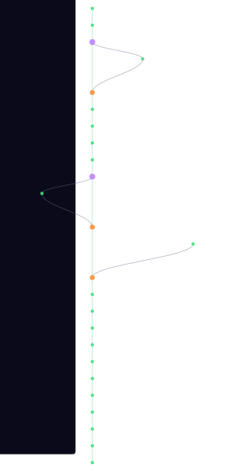

# vidcom

<!-- Project Shields/Badges -->
<p align="center">
  <a href="https://github.com/xaoscience/vidcom">
    
  </a>
  <a href="https://github.com/xaoscience/vidcom/releases">
    
  </a>
  <a href="https://github.com/xaoscience/vidcom/blob/main/LICENSE">
    
  </a>
</p>

<p align="center">
  <a href="https://github.com/xaoscience/vidcom/actions">
    
  </a>
  <a href="https://github.com/xaoscience/vidcom/issues">
    
  </a>
  <a href="https://github.com/xaoscience/vidcom/pulls">
    
  </a>
  <a href="https://github.com/xaoscience/vidcom/stargazers">
    
  </a>
  <a href="https://github.com/xaoscience/vidcom/network/members">
    
  </a>
</p>

<p align="center">
  
  
  
  
</p>

<!-- Optional: Stability/Maturity Badge -->
<p align="center">
  
  
</p>

---

<p align="center">
  <b>Video Compilations</b>
</p>

---

## 📋 Table of Contents

- [Overview](#-overview)
- [Features](#-features)
- [Installation](#-installation)
- [Usage](#-usage)
- [Configuration](#-configuration)
- [Documentation](#-documentation)
- [Contributing](#-contributing)
- [Roadmap](#-roadmap)
- [Support](#-support)
- [License](#-license)
- [Acknowledgements](#-acknowledgements)

---

## 🔍 Overview

VIDCOM is a high-performance video compilation pipeline designed for gaming content creators. It automatically detects highlights (kills, headshots, clutches) from gaming streams and compiles them into YouTube Shorts-ready vertical videos.

### Why vidcom?

- **Pure C Implementation** - Minimal dependencies, maximum performance with ONNX Runtime
- **GPU Accelerated** - NVENC/NVDEC encoding with CUDA inference for real-time processing
- **Game-Specific Detection** - Optimised ROI regions for Fortnite, Valorant, CS2, Overwatch, Apex
- **End-to-End Pipeline** - From raw stream to uploaded YouTube Short in one command

---

## ✨ Features

- 🎮 **YOLO Highlight Detection** - ML-based detection of kills, headshots, assists, and action moments
- 🚀 **GPU Acceleration** - CUDA inference + NVENC encoding for real-time processing
- 📦 **Multi-Game Support** - Fortnite, Valorant, CS2, Overwatch, Apex Legends
- 🔧 **Automated Pipeline** - Fetch → Detect → Encode → Upload workflow
- ⚡ **Batch Processing** - Process entire streams or multiple videos at once
- 🎬 **YouTube Integration** - Direct upload to YouTube with metadata

---

## 📥 Installation

### Prerequisites

- NVIDIA GPU with CUDA 11.8+ support
- FFmpeg 6.0+ with NVENC support
- ONNX Runtime 1.20+ (bundled)
- Linux (Ubuntu 22.04+ recommended)

### Quick Start

```bash
# Clone the repository
git clone https://github.com/xaoscience/vidcom.git
cd vidcom

# Install dependencies
./scripts/build-deps.sh

# Build
make

# Verify installation
./build/vidcom help
```

### Building from Source

```bash
# Install build dependencies (Ubuntu/Debian)
sudo apt install build-essential libavcodec-dev libavformat-dev \
    libavutil-dev libswscale-dev libsqlite3-dev

# Build with CUDA support
make CUDA=1

# Or CPU-only build
make CUDA=0
```

---

## 🚀 Usage

### Highlight Detection

Detect highlights (kills, headshots, etc.) in gaming footage:

```bash
# Basic usage
./build/vidcom highlights video.mp4

# With game-specific optimisation
./build/vidcom highlights stream.mp4 --game fortnite --confidence 0.6

# Verbose output
./build/vidcom highlights gameplay.mp4 --game valorant -v
```

### Batch Processing with Auto-Detection

```bash
# Auto-detect and process highlights
./scripts/process-batch.sh stream.mp4 --auto --game fortnite --max-clips 5

# Upload to YouTube
./scripts/process-batch.sh stream.mp4 --auto --game valorant --upload --privacy unlisted
```

### Manual Manifest Processing

Create a manifest file (`highlights.jsonl`):
```json
{"input": "stream.mp4", "start": "01:23:45", "duration": 55, "title": "Epic Kill", "tags": "fortnite,gaming"}
{"input": "stream.mp4", "start": "02:10:30", "duration": 45, "title": "Clutch Win", "tags": "fortnite,clutch"}
```

Process the manifest:
```bash
./scripts/process-batch.sh highlights.jsonl --upload
```

### Training a Custom Model

1. Collect training data:
```bash
./scripts/collect-training-data.sh videos/ --game fortnite --fps 2
```

2. Label frames with LabelImg or CVAT

3. Train the model:
```bash
./scripts/train-highlight-model.sh --data datasets/highlight_detection/data.yaml --epochs 100
```

---

## ⚙️ Configuration

### Configuration File

Edit `config/vidcom.conf`:

```ini
[general]
verbose = 1
use_gpu = true
device_id = 0

[highlight_detection]
# Path to YOLO ONNX model
highlight_model = models/highlight_yolov8n.onnx

# Detection confidence (0.0-1.0)
confidence_threshold = 0.5

# Game type for optimised detection
game = fortnite

# Segment timing
padding_before = 4.0
padding_after = 2.0
merge_threshold = 3.0

[encoding]
shorts_width = 1080
shorts_height = 1920
quality = 20
max_duration = 60
```

### Supported Games

| Game | Flag | Detection Region |
|------|------|------------------|
| Fortnite | `--game fortnite` | Top-right kill feed |
| Valorant | `--game valorant` | Centre kill confirmation |
| CS2 | `--game csgo2` | Top-right killfeed |
| Overwatch | `--game overwatch` | Centre elimination popup |
| Apex Legends | `--game apex` | Top-right kill feed |

### Highlight Classes

| Class | Description |
|-------|-------------|
| `KILL` | Standard elimination |
| `HEADSHOT` | Headshot indicator |
| `ASSIST` | Assist notification |
| `DOWN` | Enemy knocked (BR games) |
| `MULTI_KILL` | Double/triple/quad kills |
| `CLUTCH` | 1vX clutch situations |
| `ACTION` | High-action moments |

---

## 📚 Documentation

| Document | Description |
|----------|-------------|
| [📖 Getting Started](docs/GETTING_STARTED.md) | Quick start guide |
| [📋 API Reference](docs/API.md) | Complete API documentation |
| [🔧 Configuration](docs/CONFIGURATION.md) | Configuration options |
| [❓ FAQ](docs/FAQ.md) | Frequently asked questions |

---

## 🤝 Contributing

Contributions are welcome! Please read our [Contributing Guidelines](CONTRIBUTING.md) before submitting PRs.

1. Fork the repository
2. Create your feature branch (`git checkout -b feature/AmazingFeature`)
3. Commit your changes (`git commit -m 'Add some AmazingFeature'`)
4. Push to the branch (`git push origin feature/AmazingFeature`)
5. Open a Pull Request

See also: [Code of Conduct](CODE_OF_CONDUCT.md) | [Security Policy](SECURITY.md)

---

## 🗺️ Roadmap

- [x] {{COMPLETED_FEATURE_1}}
- [x] {{COMPLETED_FEATURE_2}}
- [ ] {{PLANNED_FEATURE_1}}
- [ ] {{PLANNED_FEATURE_2}}
- [ ] {{PLANNED_FEATURE_3}}

See the [open issues](https://github.com/xaoscience/vidcom/issues) for a full list of proposed features and known issues.

---

## 💬 Support

- 📧 **Email**: {{SUPPORT_EMAIL}}
- 💻 **Issues**: [GitHub Issues](https://github.com/xaoscience/vidcom/issues)
- 💬 **Discussions**: [GitHub Discussions](https://github.com/xaoscience/vidcom/discussions)
- 📝 **Wiki**: [GitHub Wiki](https://github.com/xaoscience/vidcom/wiki)

---

## 📄 License

Distributed under the GPL-3.0 License. See [`LICENSE`](LICENSE) for more information.

---

## 🙏 Acknowledgements

- {{ACKNOWLEDGMENT_1}}
- {{ACKNOWLEDGMENT_2}}
- {{ACKNOWLEDGMENT_3}}

---

<p align="center">
  <a href="https://github.com/xaoscience">
    
  </a>
</p>

<p align="center">
  <a href="#vidcom">⬆️ Back to Top</a>
</p>

<!-- TREE-VIZ-START -->

## Git Tree Visualisation



[Full SVG](.github/tree-viz/git-tree.svg) · [Interactive version](.github/tree-viz/git-tree.html) · [View data](.github/tree-viz/git-tree-data.json)

<!-- TREE-VIZ-END -->
